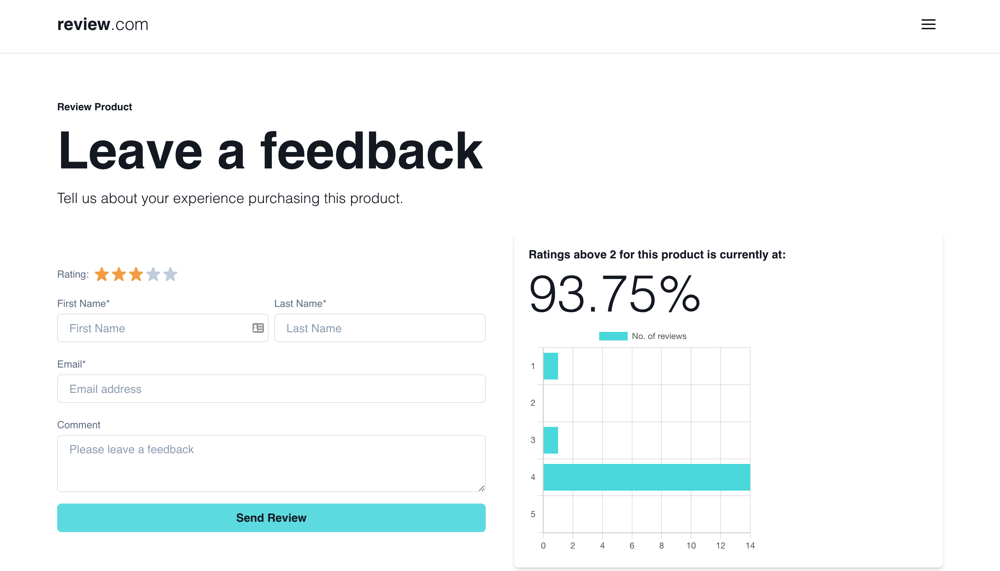

# Product Review and management demo app

[](https://circleci.com/gh/PeCrio/product-review-and-management-demo-app/tree/main)

## Table of contents

- [Product Review and management demo app](#product-review-and-management-demo-app)
  - [Table of contents](#table-of-contents)
  - [Introduction](#introduction)
  - [Major Features](#major-features)
  - [Upcoming features](#upcoming-features)
  - [Preview](#preview)
  - [Tools and technologies](#tools-and-technologies)
  - [Getting Started](#getting-started)
  - [Notes](#notes)
  - [Running locally](#running-locally)
  - [Extra notes](#extra-notes)
  - [Viewing test coverage](#viewing-test-coverage)
  - [Using Docker](#using-docker)
  - [Author](#author)
    - [Precious OSSAI](#precious-ossai)
  - [Inspiration](#inspiration)
  - [Disclaimer](#disclaimer)

## Introduction

> A customer feedback demo application for collecting reviews for a product after a successful purchase.

## Major Features

- View all comments/feedback/reviews from customers on a product.
- Customer can create feedback by entering their name, email, rating and comment
- Display product performance based on the reviews by showing a graphical preview in a chart format and the percentage of reviews above 2.

## Upcoming features

- Paginate records for reviews.
- Application logging with tools like [Sentry](https://sentry.io) and [Hotjar](https://hotjar.org)
- [Husky](https://husky.org) for running pre-commit tests before pushing code to SCM's like [GitHub](https://github.com)

## Preview

This applicaiton is currently deployed on [vercel](https://vercel.com), a demo preview can be seen on this [Preview Link](https://product-review-and-management-demo-app.vercel.app)



## Tools and technologies

Below are the main tools and technologies used in this project:

- [NextJS](https://nextjs.org) - UI Framework
- [ReactJS](https://reactjs.org) - Frontend UI library
- [Cypress](https://cypress.io) - E2E, integration and unit tests
- [ChakraUI](https://chakra-ui.com) - Design system, theming and accessibility
- [ESLint](https://eslint.org) - Linting
- [TypeScript](https://typescriptlang.org) - Type checking
- [Formik](https://formik.org) - Form validation
- [Axios](https://axios-http.org) - HTTP requests
- [Chart.js](https://chartjs.org) - Data representation package (e.g. Charts, graph)
- [Mongoose](https://mongoosejs.com) - NoSQL Database
- [Google Analytics](https://analytics.google.com) - Metrics and usage
- [CircleCI](https://circleci.com) - Continous Integration
- [Docker](https://docker.com) - Containerisation

## Getting Started

1. ## Setup environment variables
   - Create a `.env` file at the root directory of the project
   - Copy the content of the `.env.example` file onto it
   - Update the values as required. e.g. `API_URL=http://localhost:3000/api`
2. ## Development and Testing

   ## Notes

   > Before proceeding with this section, kindly ensure that your terminal window is open on the root directory of the project, you can use the below helper commands to check/confirm:

   - `cd` command to change directory e.g. `cd path/to/project`
   - `pwd` command to check your "print working directory"
   - `ls` command to show the content of your current directory

   By default the `dev` script runs on port `3000`, if you have another application making use of that port on your machine, you can either terminate that process/application or use the `--port` flag where necessary to change the running port, kindly remember to update any relative script found on the project e.g. the `package.json` and `Dockerfile`.

   ## Running locally

   ```bash
   # Step 1: Install dependencies
   $ npm install

   # Step 2: Run Nextjs and cypress in interactive mode concurrently
   $ npm run develop
   ```

   ## Extra notes

   Other commands can be found on the `package.json` file in the root directory of the project.

   ## Viewing test coverage

   > Please note that you need to have run the cypress tests at least once before a report can be generated which would be located here: `coverage/lcov-report/index.html`, you can directly open it by navigating to the folder or via your terminal with the below command:

   ```bash
   $ open coverage/lcov-report/index.html
   ```

   ## Using Docker

   > Before proceeding with the below command, ensure [Docker](https://docs.docker.com/get-docker/) is installed and running on your machine.

   ```bash
   # Runs Nextjs within a docker container
   $ docker-compose up
   ```

## Author

### Precious OSSAI

- [LinkedIn](https://www.linkedin.com/in/ossaiprecious)
- [Website](https://www.ossaiprecious.com)
- [GitHub](https://www.github.com/PeCrio)
- [Dribbble](https://www.dribbble.com/PeCrio)
- [Email](mailto:theossaiprecious@gmail.com)

## Inspiration

- [checkout.com](https://www.checkout.com)

## Disclaimer

This is a demo project for proof of concept only.
